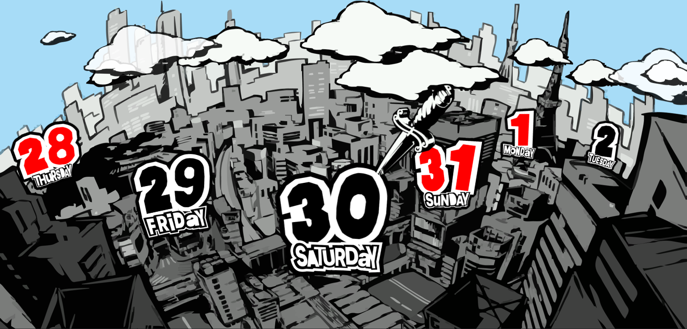
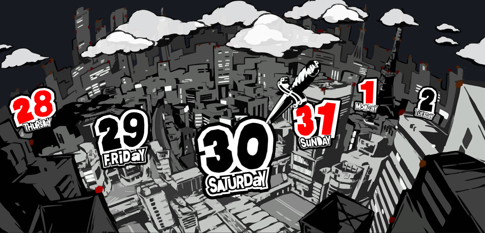
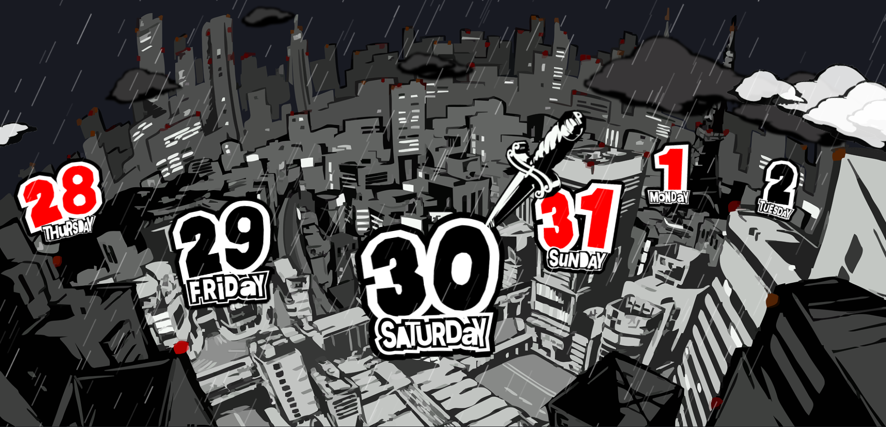

# Persona 5 Weather App

> **"Take Your Forecast!"**
>
> Aplikasi cuaca dengan tampilan yang terinspirasi dari gaya visual ikonik Persona 5, menghadirkan informasi cuaca secara real-time dengan desain yang modern, dinamis, dan penuh karakter.

---

## Tampilan Aplikasi

### City Bright



### City Night



### City Rain



---

## Video Demo


---

## Teknologi yang Digunakan

- HTML5
- CSS3
- JavaScript
- Weather API
- GSAP

---

## Cara Menjalankan

1. Clone repository ini

```bash
git clone https://github.com/Oracle4me/weather_app.git
```

2. Masuk ke folder project

```bash
cd weather_app
```

3. Jalankan menggunakan Live Server atau buka file `index.html` secara langsung di browser.

---

## Inspirasi Desain

Desain aplikasi ini terinspirasi dari antarmuka game **Persona 5** yang terkenal dengan tampilan visualnya yang unik, dinamis, dan penuh gaya.

---

## Lisensi

Project ini dibuat untuk tujuan pembelajaran dan portofolio.

Seluruh hak cipta terkait Persona 5 merupakan milik Atlus dan SEGA.
